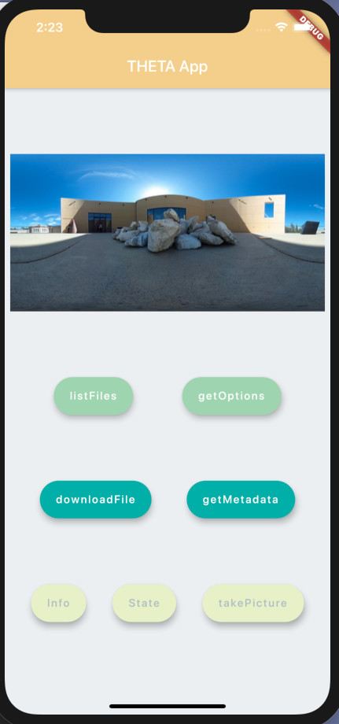
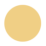
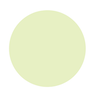
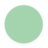
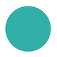

# RICOH THETA Mobile App GUI Design



The download button is not implemented.  The other buttons work with a RICOH THETA.  You connect your app to the camera in AP mode.

This was built by a teenage student for educational purposes. 

## Set Up

To build this app I used ```Dart``` and ```Flutter```. I created Column and Row widgets to hold my image and various buttons.

## Steps

* Create basic Flutter app with ```Scaffold Widget```
* Inside Scaffold make ```Column widget```
* The first child of the Column is the ```Image Widget``` (I used an AssetImage)
* The next 3 children are ```Row Widges```
* Within each Row I created multiple ```FloatingActionButtons```






[My Color Palette](https://colorhunt.co/palette/167377)
